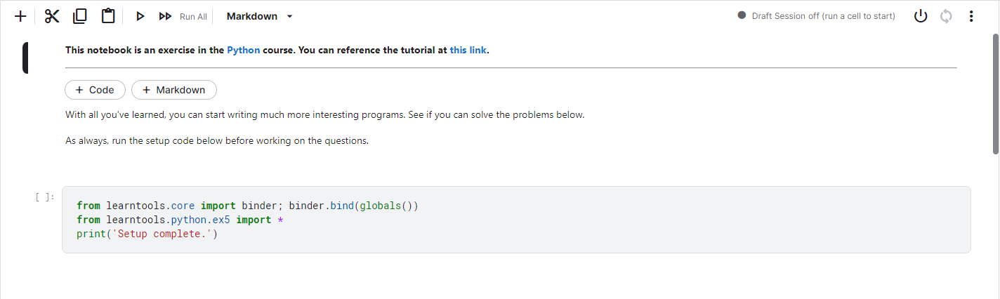
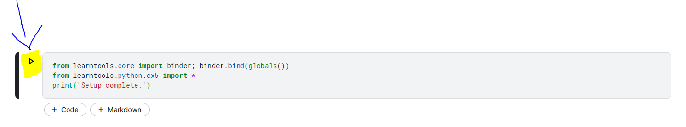
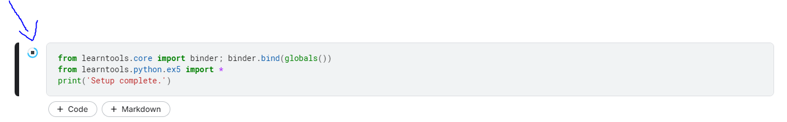
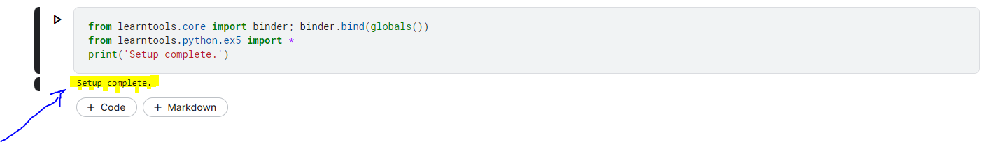

# LEMBRETE
Sempre que iniciar os exercicios de um novo Modulo, você vai se deparar com essa tela logo de inicio, esse bloco de comando vai dar um start no seu Setup, para que você possa rodar o codigo python no ambiente da Kaggle.

### Clique na linha de comando.

### Clique no icone de play que irá aparecer no lado esquerdo.

### Aguarde a instalação...

### Quando a mensagem "Setup Complete" aparecer logo abaixo, significa que o ambiente está pronto para rodar o seu codigo em python.

## Agora basta procurar as respostas de acordo com o modulo que você se encontra atualmente. Espero ter ajudado! 

Ciclo de desenvolvimento
Estudo de viabilidade, requisitos funcionais, especificação do sistema, SO, e melhoria do Sistema

Julgue os prox itens
Uma solução de infraestrutura com serviço

A,B,C
SaaS, PaaS, IaaS

Exemplo I, II, III
G2C, G2C,B2C,B2B

Afirmar
Fidelidade dos Dados em relacao as informações 

Auditoria
Atender requisitos da legislacao vigente, na esfera estadual